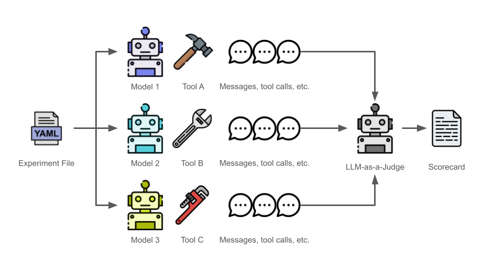

# pySunshower
**Declarative and Distributed Benchmarking for AI Agents**  
`pySunshower` is a Python library for evaluating AI agents during the *design* phase of system development. It allows you to pit AI agents against each other in parallel environments to find the best architecture for your specific agent-driven task.
* [Overview](#overview)
* [Features](#features)
* [Installation](#installation)
* [The Experiment Schema](#the-experiement-schema)
* [Usage](#usage)

## Overview
Not all AI agents are created equal. In the design phase of system development, choosing the right harness and model is critical. `pySunshower` automates this decision-making process by running trials in parallel and using an LLM to score the results.  



## Features
* **Declarative**: Define your entire experiment (teams, models, harnesses, and metrics) in YAML
* **Efficient**: Uses [Ray](https://www.ray.io/) to run multiple trials in parallel across available CPU/GPU cores
* **Automated Judging**: Implements a [LLM-as-a-Judge](https://arxiv.org/abs/2508.02921) approach to evaluate outputs based on custom rubrics like `accuracy`, `cost`, `trajectory`, and `speed`

## Installation
**Step 1.** Create a Python virtual environment.
```bash
python -m venv .venv
```

**Step 2.** Activate the Python virtual environment you just created. This step assumes you're working in a Linux-based environment. If you're using another operating system, adjust accordingly. 
```bash
source .venv/bin/activate
```

**Step 3.** Install `pySunshower`. 
```bash
pip install pysunshower
```

## The Experiment Schema
`pySunshower` uses Kubernetes-inspired YAML to define experiments. The example below defines an experiment that will run two different AI agents three times (in parallel). 
```yaml
---
apiVersion: v1
kind: ExperimentSet
metadata:
  name: Experiment Set 1
  description: The purpose of this experiment is to determine which team is the best at achieving the task.
spec:
  task: Generate a report that summarized the top 3 trending topics in cyber-related news.
  trials: 3
  teams:
    - name: Team 1
      agents:
        - name: Alpha
          model:
            provider: openai
            name: gpt-4.1
            prompt: You are a helpful assistant.
          harness:
            tools:
              - serper
    - name: Team 2
      agents:
        - name: Bravo
          model:
            provider: openai
            name: gpt-4.1
            prompt: You are a Cyber Threat Intelligence analyst assigned to support a Cyber Security Service Provider (CSSP) within the Department of Defense.
          harness:
            tools:
              - serper
  judges:
    - name: Judge 1
      model:
        provider: openai
        name: gpt-4.1
        prompt: You are a judge responsible for evaluating the output of AI agents.
      harness:
        tools:
          - serper
      metricsToEvaluate: 
        - metric: cost
          prompt: The total cost for the agent's execution must not exceed $0.05 USD, calculated from total token usage for all LLM calls. 
        - metric: speed
          prompt: The agent's total execution time must remain under 3.0 seconds.
        - metric: trajectory
          prompt: Penalize the team 1 point for every unnecessary tool call made during the workflow.
      teamsToEvaluate: [ all ]
```

## Usage
**Step 1.** Create a `.env` file in your current working directory to contain your API keys.
```bash
OPENAI_API_KEY=your_key_here
SERPER_API_KEY=your_key_here
```

**Step 2.** Run an experiment using a Python script or Jupyter Notebook. Below is a code block example.
```python
from sunshower import engine

# This will:
# 1. Spin up a local Ray cluster
# 2. Run your agents in parallel
# 3. Generate a 'results.md' scorecard
engine.start(experiments.yaml)
```

**Step 3.** After the run finishes, `pySunshower` will produce a `results.md` containing a detailed breakdown of which team "won" based on the criteria defined in your experiment file.
